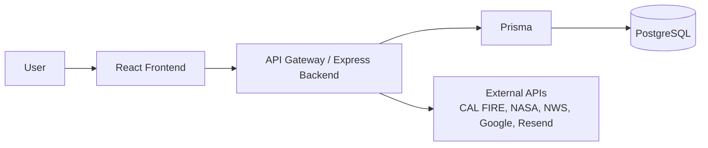
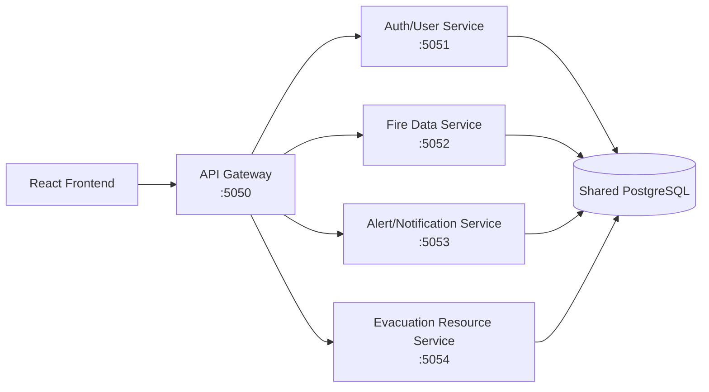
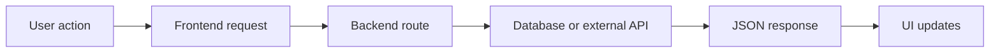

# WildFire-Tracker

WildFire-Tracker is a full-stack wildfire tracking app. Users can view wildfire data, save monitored locations, check alerts, update a profile, and view evacuation resources.

## Main Features

- Auth: login/register with JWT, guest mode, and Google OAuth placeholder.
- Map: Google Maps, CAL FIRE official fires, NASA thermal detections, and NWS weather alerts.
- User tools: profile update, saved locations, alert preferences, and local alert checks.
- Resources: evacuation resources, help/offline pages, PWA files, and microservices extra credit.

## Tech Stack

| Area | Tools |
| --- | --- |
| Frontend | React, Vite, React Router, Google Maps |
| Backend | Node.js, Express, JWT, Passport |
| Database | PostgreSQL, Prisma |
| External APIs | CAL FIRE, NASA FIRMS, NWS, Google Maps, Resend |
| Bonus | API Gateway plus separate backend services |

## Architecture



## Microservices Diagram



## Data Flow



## Quick Setup

Create the database first:

```bash
createdb wildfire_tracker
```

Backend:

```bash
cd server
npm install
cp .env.example .env
npm run prisma:generate
npm run prisma:migrate
npm run seed
npm run dev:microservices
```

Frontend:

```bash
cd client
npm install
cp .env.example .env
npm run dev
```

Seeded login: `demo@example.com` / `password123`

Single-server option: `cd server && npm run dev:single`

## Required Environment 

Minimum `server/.env`:

```bash
DATABASE_URL="postgresql://YOUR_USER@localhost:5432/wildfire_tracker?schema=public"
JWT_SECRET=replace_with_a_long_random_value
FRONTEND_URL=http://localhost:5173
```

Minimum `client/.env`:

```bash
VITE_API_URL=http://localhost:5050
VITE_GOOGLE_MAPS_API_KEY=your_browser_maps_key
```

## Helpful Docs

- [System architecture diagram](docs/system-architecture.md)
- [C4 diagrams](docs/c4-diagrams.md)
- [Microservices architecture](docs/microservices-architecture.md)
- [Backend and deployment notes](docs/BACKEND_NOTES.md)
- [Remaining TODOs](docs/TODO_NOTES.md)
