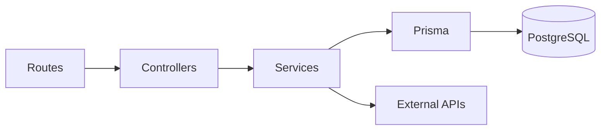

# Backend And Deployment Notes



| Layer | Folder | Job |
| --- | --- | --- |
| Routes | `server/src/routes` | URL paths and middleware |
| Controllers | `server/src/controllers` | Read request, send response |
| Services | `server/src/services` | App logic and external API calls |
| Middleware | `server/src/middleware` | Auth, validation, errors |
| Prisma | `server/prisma` | Database schema, migrations, seed |

## Main Routes

| Area | Routes |
| --- | --- |
| Health | `GET /api/health` |
| Auth | `POST /api/auth/signup`, `POST /api/auth/login`, `GET /api/auth/me`, `GET /api/auth/google` |
| Profile | `GET/PUT/DELETE /api/users/profile` |
| Saved locations | `GET/POST /api/users/saved-locations`, `PUT/DELETE /api/users/saved-locations/:id` |
| Alerts | `GET/POST/PUT /api/alerts`, `GET /api/alerts/local` |
| Fires | `GET/POST /api/fires`, `GET/PUT/DELETE /api/fires/:id`, `GET /api/fires/nearby` |
| Weather | `GET /api/nws-alerts`, `GET /api/nws-alerts/nearby` |
| Resources | `GET/POST /api/evacuation-resources`, `GET/PUT/DELETE /api/evacuation-resources/:id`, `GET /api/evacuation-resources/nearby` |
| Google helpers | `GET /api/locations/geocode`, `GET /api/locations/nearby`, `GET /api/air-quality` |

Use `docs/api-testing.md` for full curl examples.

## Required Environment

Minimum `server/.env` values:

```bash
PORT=5050
DATABASE_URL="postgresql://YOUR_USER@localhost:5432/wildfire_tracker?schema=public"
JWT_SECRET=replace_with_a_long_random_value
FRONTEND_URL=http://localhost:5173
```

Optional values:

| Feature | Env values |
| --- | --- |
| Google OAuth | `GOOGLE_CLIENT_ID`, `GOOGLE_CLIENT_SECRET`, `GOOGLE_CALLBACK_URL` |
| Google helpers | `GOOGLE_MAPS_API_KEY`, `GOOGLE_GEOCODING_API_KEY`, `GOOGLE_PLACES_API_KEY`, `GOOGLE_AIR_QUALITY_API_KEY` |
| NASA hotspots | `NASA_FIRMS_MAP_KEY`, `NASA_FIRMS_API_URL` |
| Email alerts | `RESEND_API_KEY`, `ALERT_FROM_EMAIL` |

## Commands

```bash
cd server
npm install
npm run prisma:generate
npm run prisma:migrate
npm run seed
npm run dev:microservices
```

Single backend mode:

```bash
npm run dev:single
```