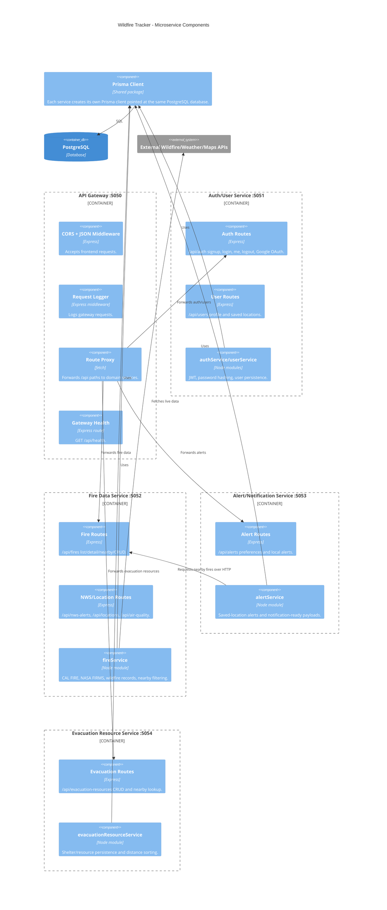

# C4 Component Diagram

```mermaid
C4Component
  title Wildfire Tracker - Microservice Components
  Container_Boundary(gateway, "API Gateway :5050") {
    Component(cors, "CORS + JSON Middleware", "Express", "Accepts frontend requests.")
    Component(logger, "Request Logger", "Express middleware", "Logs gateway requests.")
    Component(proxy, "Route Proxy", "fetch", "Forwards /api paths to domain services.")
    Component(gHealth, "Gateway Health", "Express route", "GET /api/health.")
  }
  Container_Boundary(auth, "Auth/User Service :5051") {
    Component(authRoutes, "Auth Routes", "Express", "/api/auth signup, login, me, logout, Google OAuth.")
    Component(userRoutes, "User Routes", "Express", "/api/users profile and saved locations.")
    Component(authSvc, "authService/userService", "Node modules", "JWT, password hashing, user persistence.")
  }
  Container_Boundary(fire, "Fire Data Service :5052") {
    Component(fireRoutes, "Fire Routes", "Express", "/api/fires list/detail/nearby/CRUD.")
    Component(nwsRoutes, "NWS/Location Routes", "Express", "/api/nws-alerts, /api/locations, /api/air-quality.")
    Component(fireSvc, "fireService", "Node module", "CAL FIRE, NASA FIRMS, wildfire records, nearby filtering.")
  }
  Container_Boundary(alerts, "Alert/Notification Service :5053") {
    Component(alertRoutes, "Alert Routes", "Express", "/api/alerts preferences and local alerts.")
    Component(alertSvc, "alertService", "Node module", "Saved-location alerts and notification-ready payloads.")
  }
  Container_Boundary(evac, "Evacuation Resource Service :5054") {
    Component(evacRoutes, "Evacuation Routes", "Express", "/api/evacuation-resources CRUD and nearby lookup.")
    Component(evacSvc, "evacuationResourceService", "Node module", "Shelter/resource persistence and distance sorting.")
  }
  Component(prisma, "Prisma Client", "Shared package", "Each service creates its own Prisma client pointed at the same PostgreSQL database.")
  ContainerDb(db, "PostgreSQL", "Database")
  System_Ext(external, "External Wildfire/Weather/Maps APIs")

  Rel(proxy, authRoutes, "Forwards auth/users")
  Rel(proxy, fireRoutes, "Forwards fire data")
  Rel(proxy, alertRoutes, "Forwards alerts")
  Rel(proxy, evacRoutes, "Forwards evacuation resources")
  Rel(alertSvc, fireRoutes, "Requests nearby fires over HTTP")
  Rel(authSvc, prisma, "Uses")
  Rel(fireSvc, prisma, "Uses")
  Rel(alertSvc, prisma, "Uses")
  Rel(evacSvc, prisma, "Uses")
  Rel(prisma, db, "SQL")
  Rel(fireSvc, external, "Fetches live data")
```
