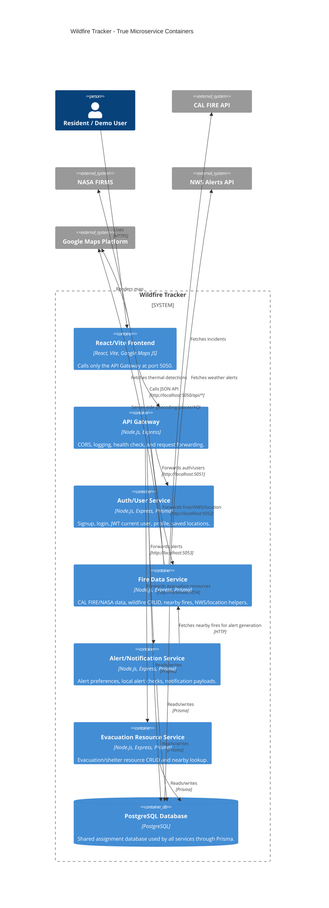

# C4 Container Diagram

```mermaid
C4Container
  title Wildfire Tracker - True Microservice Containers
  Person(user, "Resident / Demo User")
  System_Boundary(app, "Wildfire Tracker") {
    Container(web, "React/Vite Frontend", "React, Vite, Google Maps JS", "Calls only the API Gateway at port 5050.")
    Container(gateway, "API Gateway", "Node.js, Express", "CORS, logging, health check, and request forwarding.")
    Container(auth, "Auth/User Service", "Node.js, Express, Prisma", "Signup, login, JWT current user, profile, saved locations.")
    Container(fire, "Fire Data Service", "Node.js, Express, Prisma", "CAL FIRE/NASA data, wildfire CRUD, nearby fires, NWS/location helpers.")
    Container(alerts, "Alert/Notification Service", "Node.js, Express, Prisma", "Alert preferences, local alert checks, notification payloads.")
    Container(evac, "Evacuation Resource Service", "Node.js, Express, Prisma", "Evacuation/shelter resource CRUD and nearby lookup.")
    ContainerDb(db, "PostgreSQL Database", "PostgreSQL", "Shared assignment database used by all services through Prisma.")
  }
  System_Ext(calfire, "CAL FIRE API")
  System_Ext(nasa, "NASA FIRMS")
  System_Ext(nws, "NWS Alerts API")
  System_Ext(google, "Google Maps Platform")

  Rel(user, web, "Uses", "HTTPS")
  Rel(web, gateway, "Calls JSON API", "http://localhost:5050/api/*")
  Rel(gateway, auth, "Forwards auth/users", "http://localhost:5051")
  Rel(gateway, fire, "Forwards fires/NWS/location", "http://localhost:5052")
  Rel(gateway, alerts, "Forwards alerts", "http://localhost:5053")
  Rel(gateway, evac, "Forwards evacuation resources", "http://localhost:5054")
  Rel(alerts, fire, "Fetches nearby fires for alert generation", "HTTP")
  Rel(auth, db, "Reads/writes", "Prisma")
  Rel(fire, db, "Reads/writes", "Prisma")
  Rel(alerts, db, "Reads/writes", "Prisma")
  Rel(evac, db, "Reads/writes", "Prisma")
  Rel(fire, calfire, "Fetches incidents")
  Rel(fire, nasa, "Fetches thermal detections")
  Rel(fire, nws, "Fetches weather alerts")
  Rel(web, google, "Renders map")
  Rel(fire, google, "Server-side geocoding/places/AQI")
```
