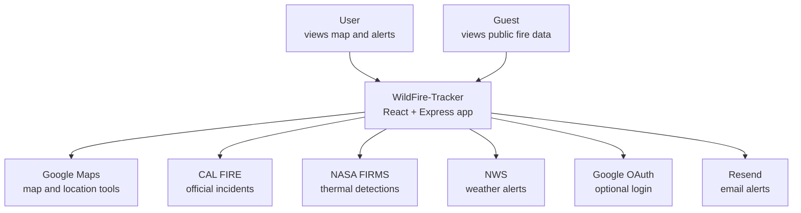
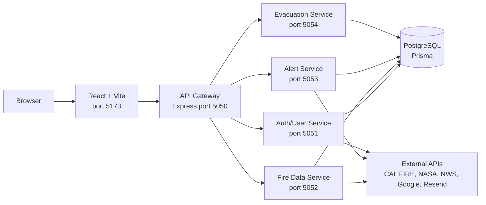
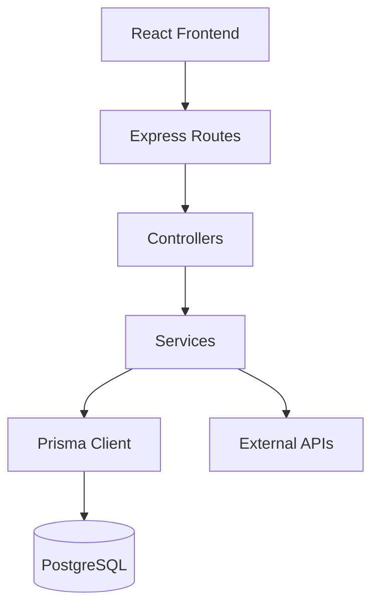

# C4 Diagrams

These diagrams show the current WildFire-Tracker architecture.

## 1. Context

The app is used by a visitor or logged-in user. It also talks to outside data providers.

## 2. Container

The frontend calls one backend URL. The gateway sends requests to the service that owns that feature.

## 3. Component

Inside the backend, routes call controllers, controllers call services, and services use Prisma or outside APIs.

## Code Match

| Diagram part | Code location |
| --- | --- |
| React frontend | `client/src` |
| API Gateway | `server/src/gateway` |
| Auth/User Service | `server/src/microservices/authUser` |
| Fire Data Service | `server/src/microservices/fireData` |
| Alert Service | `server/src/microservices/alertNotification` |
| Evacuation Service | `server/src/microservices/evacuationResource` |
| Prisma schema | `server/prisma/schema.prisma` |
