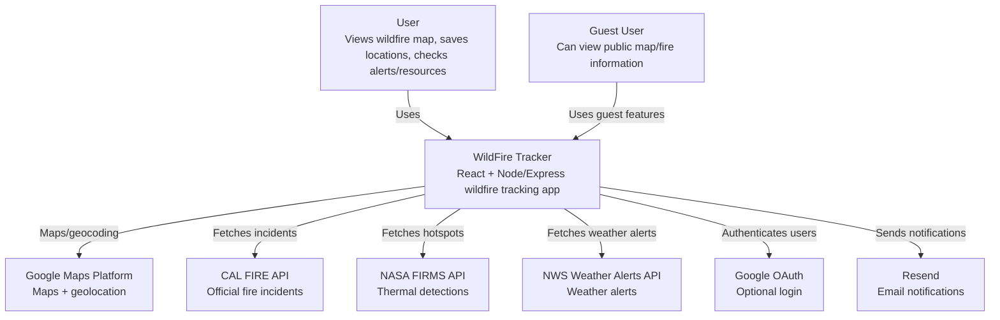
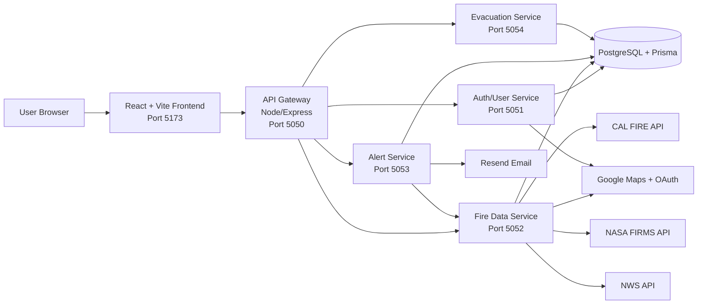

# WildFire Tracker C4 Diagrams

## Context Diagram

```mermaid
flowchart TB
    User[User<br/>Views wildfire map, saves locations, checks alerts/resources]
    Guest[Guest User<br/>Can view public map/fire information]
    App[WildFire Tracker<br/>React + Node/Express wildfire tracking app]

    GoogleMaps[Google Maps Platform<br/>Maps + geolocation]
    CALFIRE[CAL FIRE API<br/>Official fire incidents]
    NASA[NASA FIRMS API<br/>Thermal detections]
    NWS[NWS Weather Alerts API<br/>Weather alerts]
    OAuth[Google OAuth<br/>Optional login]
    Resend[Resend<br/>Email notifications]

    User -->|Uses| App
    Guest -->|Uses guest features| App
    App -->|Maps/geocoding| GoogleMaps
    App -->|Fetches incidents| CALFIRE
    App -->|Fetches hotspots| NASA
    App -->|Fetches weather alerts| NWS
    App -->|Authenticates users| OAuth
    App -->|Sends notifications| Resend
```

## Container Diagram

```mermaid
flowchart LR
    User[User Browser]
    Frontend[React + Vite Frontend<br/>Port 5173]
    Gateway[API Gateway<br/>Node/Express<br/>Port 5050]

    Auth[Auth/User Service<br/>Port 5051]
    Fire[Fire Data Service<br/>Port 5052]
    Alerts[Alert Service<br/>Port 5053]
    Evac[Evacuation Service<br/>Port 5054]

    DB[(PostgreSQL + Prisma)]

    CALFIRE[CAL FIRE API]
    NASA[NASA FIRMS API]
    NWS[NWS API]
    Google[Google Maps + OAuth]
    Resend[Resend Email]

    User --> Frontend
    Frontend --> Gateway

    Gateway --> Auth
    Gateway --> Fire
    Gateway --> Alerts
    Gateway --> Evac

    Auth --> DB
    Fire --> DB
    Alerts --> DB
    Evac --> DB

    Fire --> CALFIRE
    Fire --> NASA
    Fire --> NWS
    Fire --> Google

    Auth --> Google
    Alerts --> Resend
    Alerts --> Fire
```
