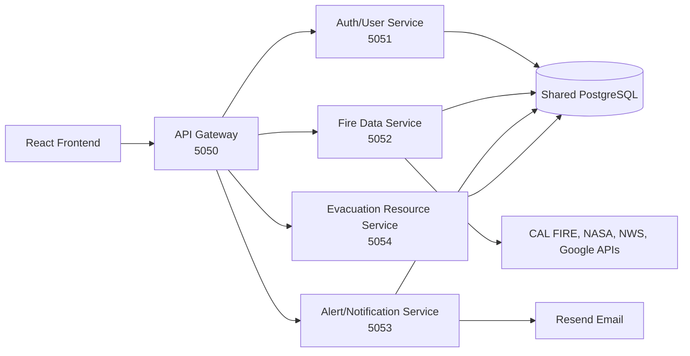
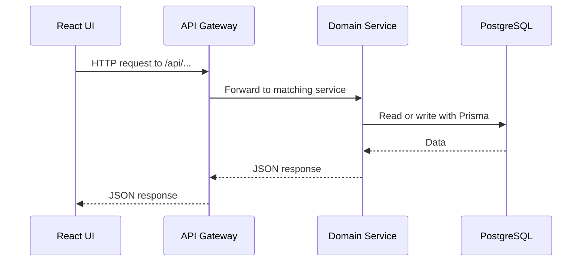

# Microservices Architecture

This is the bonus extra credit part of the project.

The frontend still uses one API URL:

```text
VITE_API_URL=http://localhost:5050
```

Port `5050` is the API Gateway. It receives frontend requests and forwards them to smaller backend services.

## Diagram



## Services

| Service | What it does |
| --- | --- |
| API Gateway | Main entry point. Handles CORS, health check, logging, and forwarding. |
| Auth/User Service | Handles signup, login, JWT, Google OAuth placeholder, profile, and saved locations. |
| Fire Data Service | Gets fire data, weather alerts, Google helper data, and wildfire CRUD. |
| Alert/Notification Service | Saves alert preferences and checks local fire alerts. |
| Evacuation Resource Service | Saves, updates, deletes, lists, and searches evacuation resources. |
| PostgreSQL database | Shared database used by all services through Prisma. |

## How Requests Move



## Local Commands

Run everything together:

```bash
cd server
npm install
npm run prisma:generate
npm run prisma:migrate
npm run seed
npm run dev:microservices
```

Run one service at a time:

```bash
npm run dev:gateway
npm run dev:auth
npm run dev:fire
npm run dev:alerts
npm run dev:evacuation
```