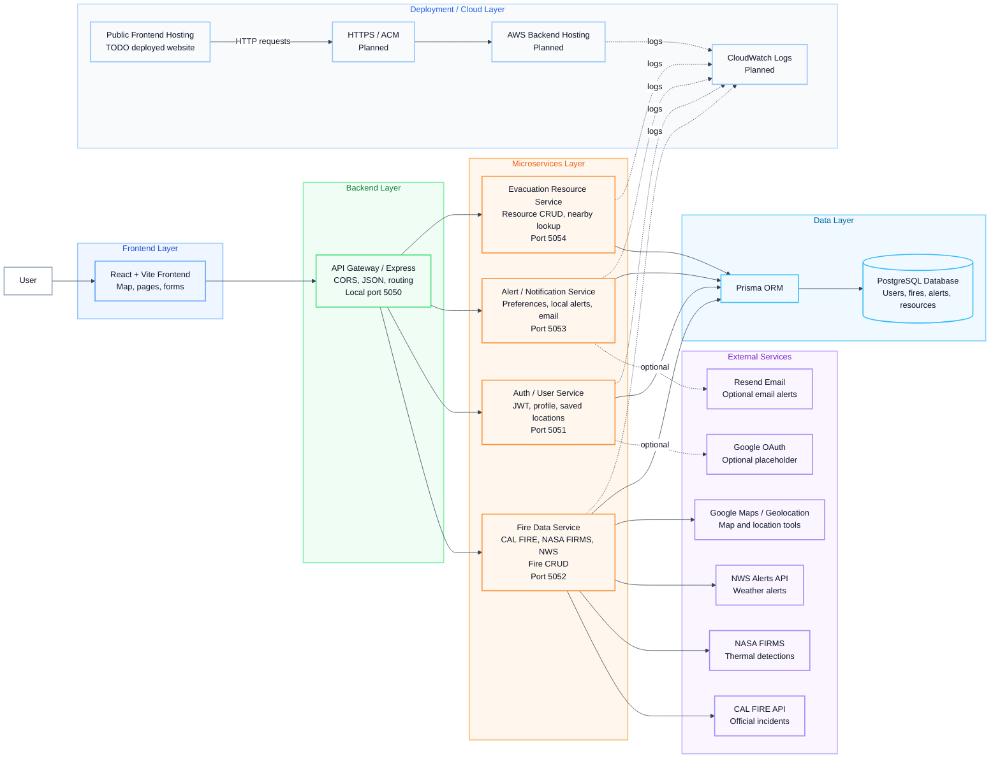

# System Architecture

This diagram shows the full WildFire-Tracker system.

It includes the React frontend, API Gateway, backend services, PostgreSQL/Prisma database, external APIs, and planned deployment pieces.

## Main Architecture Diagram

## Component Explanation

| Part | What it does |
| --- | --- |
| React frontend | Shows the map, pages, forms, alerts, and resources. |
| API Gateway / Express | Main backend entry point. Handles CORS and sends requests to services. |
| Auth/User Service | Handles signup, login, JWT, profile, and saved locations. |
| Fire Data Service | Gets CAL FIRE, NASA FIRMS, NWS data, and supports wildfire CRUD. |
| Alert/Notification Service | Saves alert preferences and checks local alerts. |
| Evacuation Resource Service | Handles evacuation resource CRUD and nearby search. |
| Prisma + PostgreSQL | Stores users, saved locations, alert preferences, wildfire records, and resources. |
| External services | Provide maps, fire feeds, weather alerts, OAuth login, and optional email alerts. |
